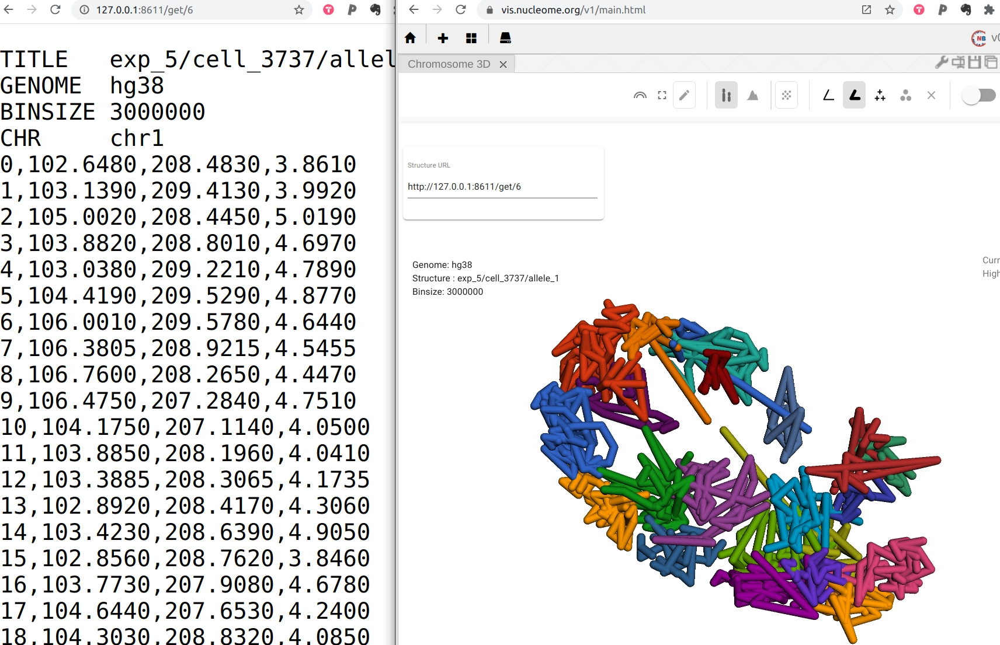

# Introduction

Nucleome Browser use nucle3D format to represent DNA 3D Structure.

## Nucle3D Structure format

An example of a nucle3D file is shown below. Each file represents a 3D structure of chromatin with a fixed bin size. The first several rows (tab-delimited) indicate the name (TITLE) of this structure, genome assembly version (GENOME), and bin size (BINSIZE). Note that the nucle3D format requires that all chromatin segments have the same bin size and those chromatin segments are non-overlapping. For each chromosome, a row starting with **CHR <chrom>** tells to which chromosome the following bins belongs. Then, the following bins show the bin-id (0-base) and XYZ positions of this chromatin segment. For example, if the bin-size is 100kb, the first bin (0 to 100kb) should have bin-id **0**. Bin-id and XYZ positions are separated by comma as shown in the example below. You can skip bins if there is no data on those bins.

```
TITLE   [NAME]        # Tab split
GENOME  hg38          # Tab split
BINSIZE [binsize]
CHR chr1 # Tab split
i,x,y,z
i,x,y,z
..
CHR chr2
..
```

## Host 3D structure using nucleserver

You can use [nucleserver](https://github.com/nucleome/nucleserver) to host custom 3D structural data. Please follow the instruction on nucleserver repo to install it.

You can put all 3D structural data in a folder (e.g. 3D). You can then start a data service to host these data using the following command.

```
# assume the folder 3D contains the structural data, each file represent a 3D structure
nucleserver file --root 3D
```

You should see a message like this "Please open http://127.0.0.1:8611". This means that all the 3D structural data can be retrieved under URL **http://127.0.0.1:8611/get/**. You can copy the URL of the 3D structural data into the input data box in 3D structure panel of the Nucleome Browser.


